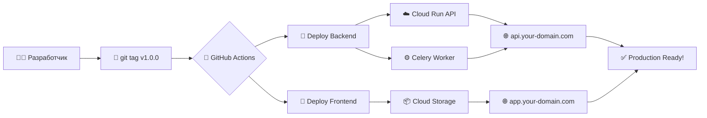

# 🚀 Django + React Production Boilerplate

> **Production-ready шаблон** для быстрого создания веб-приложений с автоматическим деплоем в GCP.

## 🎯 **Что это?**

Готовый к production boilerplate, который включает:
- ✅ **Backend:** Django + DRF + Celery + PostgreSQL + Redis
- ✅ **Frontend:** React + TypeScript + Vite + TanStack Query
- ✅ **Инфраструктура:** GCP Cloud Run + Load Balancer + SSL
- ✅ **CI/CD:** GitHub Actions с автодеплоем по тегам
- ✅ **Качество кода:** Линтинг, тестирование, pre-commit hooks

## ⚡ **Быстрый старт**

```bash
# 1. Склонируй проект
git clone https://github.com/your-username/your-project.git
cd your-project

# 2. Запусти локально (5 минут)
make start

# 3. Проверь что работает
curl http://localhost:8000/api/health/
open http://localhost:5173
```

**Подробнее:** [Quick Start](quick-start.md)

---

## 📚 **Документация**

| Файл | Описание | Время |
|------|----------|-------|
| [**quick-start.md**](quick-start.md) | 🏃‍♂️ Локальный запуск за 5 минут | ~5 мин |
| [**customization.md**](customization.md) | 🔧 Адаптация под новый проект | ~15 мин |
| [**deployment.md**](deployment.md) | 🚀 Production деплой в GCP | ~45 мин |
| [**reference.md**](reference.md) | 📚 Справочники и команды | - |

---

## 🎬 **Как это работает**



**Один git tag = полный автодеплой!**

---

## 🛠️ **Стек технологий**

### Backend:
- **Django 5.1** - Web framework
- **Django REST Framework** - API
- **Celery** - Асинхронные задачи
- **PostgreSQL** - База данных
- **Redis** - Кэш и брокер для Celery
- **JWT** - Аутентификация
- **uv** - Управление зависимостями
- **pytest** - Тестирование

### Frontend:
- **React 18** - UI библиотека
- **TypeScript** - Типизация
- **Vite** - Build tool
- **TanStack Query** - Состояние сервера
- **React Router** - Маршrutизация
- **Tailwind CSS** - Стили
- **Vitest** - Тестирование
- **i18next** - Интернационализация

### DevOps:
- **Docker** - Контейнеризация
- **GitHub Actions** - CI/CD
- **GCP Cloud Run** - Serverless контейнеры
- **GCP Load Balancer** - Балансировщик + SSL
- **GCP Cloud SQL** - Управляемый PostgreSQL
- **Upstash Redis** - Управляемый Redis

---

## 🏗️ **Архитектура**

```
┌─────────────────┐    ┌──────────────────┐    ┌─────────────────┐
│   React SPA     │    │   Load Balancer  │    │  Django API     │
│                 │    │                  │    │                 │
│ • TypeScript    │    │ • SSL Termination│    │ • REST API      │
│ • TanStack Query│◄──►│ • Static Files   │◄──►│ • JWT Auth      │
│ • Tailwind CSS │    │ • SPA Routing    │    │ • Admin Panel   │
└─────────────────┘    └──────────────────┘    └─────────────────┘
         │                                                │
         │                                                ▼
         │              ┌─────────────────┐    ┌─────────────────┐
         │              │ Cloud Storage   │    │ Celery Worker   │
         │              │                 │    │                 │
         │              │ • Static Assets │    │ • Background    │
         └─────────────►│ • Build Files   │    │   Tasks         │
                        │ • CDN Cache     │    │ • Health Checks │
                        └─────────────────┘    └─────────────────┘
                                                       │
                                                       ▼
┌─────────────────────────────────────────────────────────────────┐
│                     Shared Services                            │
│                                                                │
│  ┌──────────────┐    ┌──────────────┐    ┌──────────────┐    │
│  │ PostgreSQL   │    │    Redis     │    │Secret Manager│    │
│  │              │    │              │    │              │    │
│  │ • User Data  │    │ • Sessions   │    │ • API Keys   │    │
│  │ • App Data   │    │ • Task Queue │    │ • DB Creds   │    │
│  └──────────────┘    └──────────────┘    └──────────────┘    │
└─────────────────────────────────────────────────────────────────┘
```

---

## 💡 **Почему именно этот boilerplate?**

### ✅ **Проверен в production:**
- Прошли все грабли вместе
- Исправлены критичные ошибки GCP
- Настроена безопасность

### ⚡ **Быстрый старт:**
- Локально работает из коробки
- Один тег = полный деплой
- Подробная документация

### 🔒 **Production-ready:**
- SSL сертификаты
- Load Balancer с CDN
- Секреты в Secret Manager
- Health checks и мониторинг

### 🛡️ **Качество кода:**
- Автоматические тесты
- Линтинг и форматирование  
- Type checking
- Pre-commit hooks

---

## 📋 **Чек-лист использования**

### Локальная разработка:
- [ ] Склонировал проект
- [ ] Запустил `make start`
- [ ] Проверил все эндпоинты
- [ ] Прогнал тесты `make test`

### Адаптация проекта:
- [ ] Переименовал `botbalance` → `your-project`
- [ ] Сменил домены `.me` → `.your-domain.com`
- [ ] Обновил GitHub репозиторий
- [ ] Создал GCP проект

### Production деплой:
- [ ] Настроил GCP инфраструктуру
- [ ] Добавил секреты в GCP и GitHub
- [ ] Создал первый git tag
- [ ] Проверил что все работает

---

## 🎯 **Результат**

После прохождения всех шагов у тебя будет:

- 🌐 **Работающее приложение** на `https://app.your-domain.com`
- 🔗 **API** на `https://api.your-domain.com`
- 🔐 **Админка** на `https://api.your-domain.com/nukoadmin/`
- ⚡ **Автодеплой** по git тегам
- 📊 **Мониторинг** и health checks
- 🔒 **SSL + CDN** настроены
- 🧪 **Тестирование** и качество кода

---

## 🚀 **Начинай с Quick Start!**

**Следующий шаг:** [Quick Start - Локальная разработка](quick-start.md)

---

*Создано с ❤️ для быстрого создания production-ready приложений*
